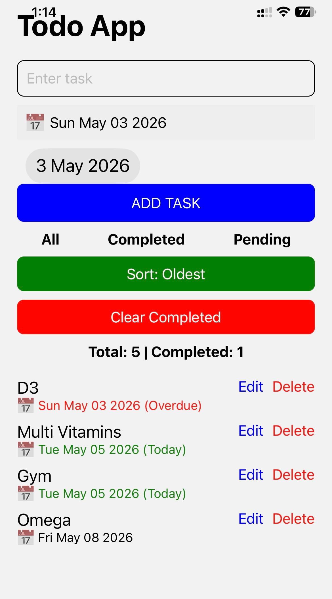

# Todo App — React Native + Expo

## Live Demo

APK available via Expo EAS build (see installation section)

## Preview



A cross-platform Todo mobile application built using React Native and Expo. The app enables efficient task management with features like editing, filtering, sorting, and persistent local storage.

---

## Features

* Add tasks with date
* Mark tasks as completed
* Edit tasks inline
* Delete tasks
* Filter tasks (All / Completed / Pending)
* Clear all completed tasks
* Date picker integration
* Sort tasks by date (Oldest / Newest)
* Highlight overdue and today’s tasks
* Task statistics (Total & Completed)
* Persistent storage using AsyncStorage
* Clean and responsive mobile UI

---

## Tech Stack

* React Native
* Expo
* TypeScript
* AsyncStorage
* Expo EAS

---

## Installation & Setup

```bash
git clone https://github.com/Mahiisss/Todo-App.git
cd Todo-App
npm install
npx expo start
```

---

## Running the App

### Using Expo Go

1. Install Expo Go (Android / iOS)
2. Run:

```bash
npx expo start
```

3. Scan the QR code

### Android APK

To generate an APK:

```bash
eas build -p android --profile preview
```

After the build completes:

* Download APK from Expo dashboard
* Install it on your Android device

---

## Key Concepts Used

* React Hooks (useState, useEffect)
* State-driven UI updates
* Conditional rendering
* Array operations (map, filter, sort)
* Local storage handling
* Cross-platform mobile development

---

## Learning Outcome

This project demonstrates building a complete mobile application using React Native, including task management, state handling, persistent storage, and APK deployment using Expo EAS.

---

## Future Improvements

* Search functionality
* Priority-based tasks
* Cloud sync (Firebase)
* Notifications/reminders

---

## Author

Mahi
